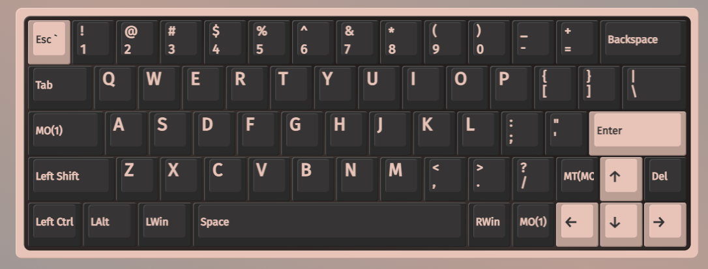

# QMK Userspace

This is a QMK userspace directory which allows setting keyboards that use QMK keymaps to be defined and compiled.

Currently included keyboards and features:

- **Xiudi XD60 Rev3** with VIA support and custom keymap (carlosedp). Layout: 
- **Monsgeek M1 V5 US** with custom keymap (carlosedp).

## Quickstart: Setting Up QMK Locally and Building Your Firmware

1. **Install QMK CLI**
   - Follow the [QMK CLI installation guide](https://docs.qmk.fm/#/newbs_getting_started?id=qmk-cli) or run:

     ```sh
     # If uv is not installed, install it first
     curl -LsSf https://astral.sh/uv/install.sh | sh
     # Then install QMK CLI
     uv tool install qmk
     qmk setup -H $HOME/repos/qmk_firmware
     ```

   - This will clone the QMK firmware repo and set up the environment.

2. **Clone Your Userspace Config**
   - Clone this repository (your userspace config) to your machine:

     ```sh
     git clone https://github.com/carlosedp/qmk_userspace.git
     cd qmk_userspace
     ```

3. **Configure QMK to Use Your Userspace**
   - Set the userspace overlay directory:

     ```sh
     qmk config user.overlay_dir="$(realpath .)"
     ```

   - This makes your keymaps and settings available to QMK.

4. **Build Your Firmware**
   - Compile for your keyboard and keymap (replace with your values):

     ```sh
     qmk compile -kb xiudi/xd60/rev3 -km carlosedp
     ```

   - The resulting firmware file will be in the `qmk_userspace` directory, typically under `xiudi_xd60_rev3_carlosedp.hex` in the case of xd60 keyboard.

## Configuring Your Layout in VIA

1. **Open VIA**
   - Download and install [VIA](https://usevia.app/) if you haven't already.

2. **Load the VIA JSON**
   - In VIA, go to the Settings tab and enable "Show Design Tab".
   - In the "Design" tab and use the "Load Draft Definition" option.
   - Select the file: `keyboards/xiudi/xd60/rev3/XD60_VIA.json` from this repository.

3. **Connect Your Keyboard**
   - Plug in your keyboard with the new firmware flashed.
   - VIA should automatically detect it. If not, ensure the correct JSON is loaded and the firmware supports VIA.

4. **Customize Your Layout**
   - In the "Configure" tab, first define your layout for the "Shift Row" and "Bottom Row" sections.
   - Use VIA's interface to remap keys, layers, and lighting as desired.

---

## Configuring and adding new keymaps

1. Run the normal `qmk setup` procedure if you haven't already done so -- see [QMK Docs](https://docs.qmk.fm/#/newbs) for details.
2. Enable userspace in QMK config using `qmk config user.overlay_dir="$(realpath qmk_userspace)"`
3. Add a new keymap for your board using `qmk new-keymap`
    - This will create a new keymap in the `keyboards` directory, in the same location that would normally be used in the main QMK repository. For example, if you wanted to add a keymap for the Planck, it will be created in `keyboards/planck/keymaps/<your keymap name>`
    - You can also create a new keymap using `qmk new-keymap -kb <your_keyboard> -km <your_keymap>`
    - Alternatively, add your keymap manually by placing it in the location specified above.
    - `layouts/<layout name>/<your keymap name>/keymap.*` is also supported if you prefer the layout system
4. Add your keymap(s) to the build by running `qmk userspace-add -kb <your_keyboard> -km <your_keymap>`
    - This will automatically update your `qmk.json` file
    - Corresponding `qmk userspace-remove -kb <your_keyboard> -km <your_keymap>` will delete it
    - Listing the build targets can be done with `qmk userspace-list`
5. Commit your changes

## Building your firmware

1. Run `qmk compile -kb <your_keyboard> -km <your_keymap>` to build your firmware
    - The resulting firmware file will be in the `qmk_userspace` directory, typically under `<keyboard>_<keymap>.hex`
    - For example, if you built for the Planck with a keymap named `mykeymap`, the file would be `planck_mykeymap.hex`

## Flashing Your Firmware

1. Connect your keyboard to your computer via USB.
2. Put your keyboard into bootloader mode. This usually involves pressing a specific key combination or a physical reset button on the keyboard. Refer to your keyboard's documentation for the exact method.
3. Use the QMK CLI to flash the firmware:

   ```sh
    qmk flash -kb <your_keyboard> -km <your_keymap>
    ```

    - This command will compile (if necessary) and flash the firmware to your keyboard.

If running on Windows WSL2, qmk cli doesn't access the USB device directly. You can flash using Windows QMK Toolbox which can be downloaded from <https://github.com/qmk/qmk_toolbox/releases>.
